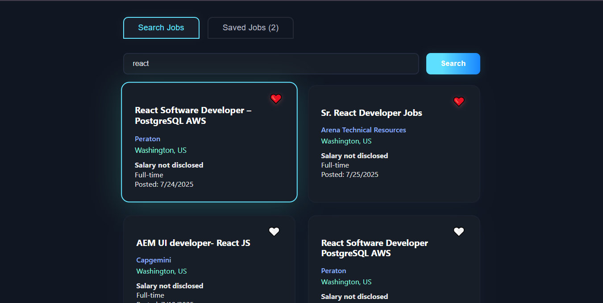
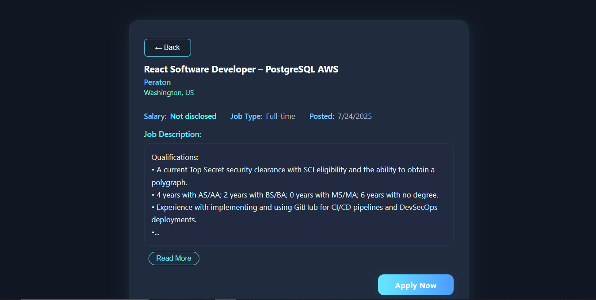
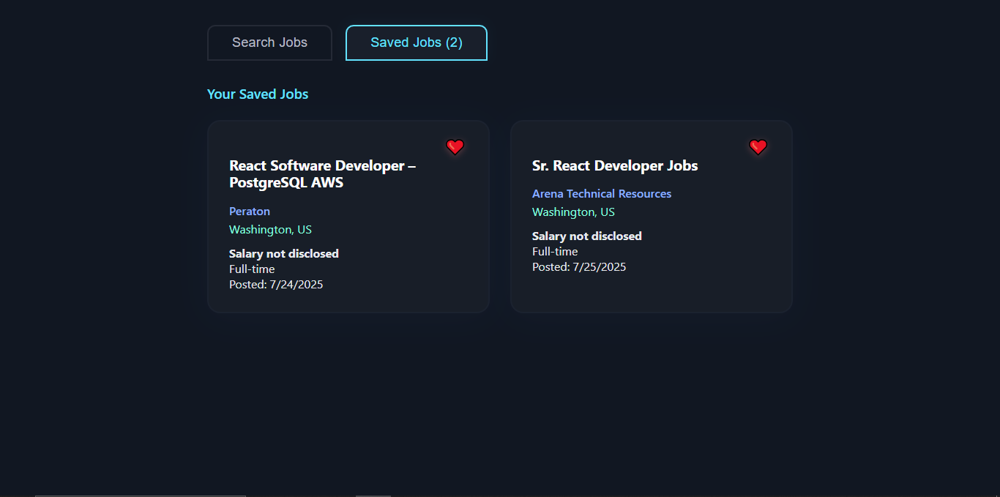

# 💼 Job Finder App

A job search application built using **React.js (with Vite)** and **JSearch API (via RapidAPI)**.  
It allows users to search for jobs, view detailed listings, and save jobs locally.

---

## 🚀 Features

- 🔍 Search jobs by keyword using JSearch API  
- 📄 View full job details (title, company, salary, description)  
- ❤️ Save jobs using localStorage  
- 🧭 Tab-based UI to switch between Search and Saved Jobs  
- ⚠️ Error handling with custom messages and loading spinner  
- 📱 Responsive design for better mobile experience

---

## 🛠️ Tech Stack

- React.js (Vite)
- JavaScript (ES6+)
- RapidAPI – JSearch API
- HTML5, CSS3

---
## 📸 Screenshots

### 🔍 Job Search Page


### 📄 Job Detail Page


### ❤️ Saved Jobs Tab


---
## 📦 Getting Started

To run the project locally:

```bash
git clone https://github.com/kaizenarin/job-finder-app.git
cd job-finder-app
npm install
npm run dev
